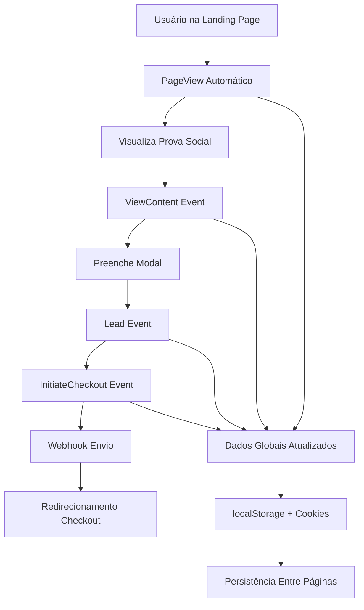

# 🚀 Facebook Conversions API - Infraestrutura Implementada

## 📋 **VISÃO GERAL**

Esta documentação descreve a infraestrutura completa implementada para o Facebook Conversions API, incluindo todos os utilitários, hooks e configurações necessárias.

## 🏗️ **ARQUITETURA IMPLEMENTADA**

```
src/
├── types/
│   └── facebook-conversions.ts     # ✅ Definições TypeScript completas
├── lib/
│   ├── facebook-conversions.ts     # ✅ Utilitários core (cookies, UUID, etc.)
│   ├── checkout-url-builder.ts     # ✅ Construtor de URLs de checkout
│   └── webhook-sender.ts           # ✅ Envio para webhook com retry
├── hooks/
│   └── useFacebookConversions.ts   # ✅ Hook principal para eventos
└── app/
    ├── page.tsx                    # 🔄 Para integração (Fase 2)
    └── ...
```

## ⚙️ **CONFIGURAÇÃO NECESSÁRIA**

### 1. Variáveis de Ambiente (`.env.local`)

```bash
# ==============================================
# FACEBOOK CONVERSIONS API - CONFIGURAÇÕES  
# ==============================================

# URL base da sua API de Conversões do Facebook
NEXT_PUBLIC_FB_CONVERSIONS_API_URL=https://sua-api.railway.app

# URL do checkout (ex: https://checkout.cakto.com.br/seu-produto)
NEXT_PUBLIC_CHECKOUT_URL=https://checkout.cakto.com.br/kit-inteligencia

# URL do webhook para envio de dados de leads
NEXT_PUBLIC_WEBHOOK_URL=https://webhook.exemplo.com/leads

# Facebook Pixel ID (opcional - para deduplicação)
NEXT_PUBLIC_FB_PIXEL_ID=123456789012345

# ==============================================
# CONFIGURAÇÕES DE DESENVOLVIMENTO
# ==============================================

# Ativar modo debug (true/false)
NEXT_PUBLIC_DEBUG_MODE=true

# Moeda padrão
NEXT_PUBLIC_DEFAULT_CURRENCY=BRL
```

### 2. Next.js Configuration

O `next.config.ts` já foi configurado para expor as variáveis de ambiente necessárias.

## 🎯 **COMO USAR**

### 1. Hook Principal - `useFacebookConversions`

```typescript
import { useFacebookConversions } from '@/hooks/useFacebookConversions';

function MeuComponente() {
  const {
    sendPageView,
    sendViewContent,
    sendInitiateCheckout,
    sendLead,
    updateUserData,
    getUserData,
    isReady,
    debugInfo
  } = useFacebookConversions();

  // Uso dos métodos...
}
```

### 2. Envio Automático de PageView

```typescript
import { useAutoPageView } from '@/hooks/useFacebookConversions';

function Layout() {
  useAutoPageView(); // Envia PageView automaticamente
  
  return (
    <div>...</div>
  );
}
```

### 3. Evento ViewContent (Prova Social)

```typescript
// Quando usuário visualiza seção de prova social
const handleViewSocialProof = useCallback(() => {
  sendViewContent({
    content_name: 'Social Proof Section',
    content_category: 'Landing Page Section',
    value: 0
  });
}, [sendViewContent]);

useEffect(() => {
  const observer = new IntersectionObserver((entries) => {
    if (entries[0].isIntersecting) {
      handleViewSocialProof();
    }
  });
  
  observer.observe(sectionRef.current);
}, [handleViewSocialProof]);
```

### 4. Evento Lead + InitiateCheckout (Modal)

```typescript
import { buildCheckoutUrl } from '@/lib/checkout-url-builder';
import { sendToWebhook } from '@/lib/webhook-sender';

const handleSubmitModal = async (formData) => {
  try {
    // 1. Enviar evento Lead
    await sendLead(formData);
    
    // 2. Enviar evento InitiateCheckout
    await sendInitiateCheckout({
      value: 47,
      currency: 'BRL',
      productName: 'Kit Inteligência Estratégica'
    });
    
    // 3. Enviar para webhook
    await sendToWebhook(formData);
    
    // 4. Redirecionar para checkout
    const checkoutUrl = buildCheckoutUrl(formData);
    window.location.href = checkoutUrl;
    
  } catch (error) {
    console.error('Erro no processo:', error);
  }
};
```

## 🔧 **UTILITÁRIOS DISPONÍVEIS**

### 1. Gestão de Dados Globais

```typescript
import { 
  getGlobalUserData, 
  updateGlobalUserData,
  initializeGlobalUserData 
} from '@/lib/facebook-conversions';

// Obter dados atuais
const userData = getGlobalUserData();

// Atualizar dados
updateGlobalUserData({
  em: 'usuario@email.com',
  ph: '11999999999',
  fn: 'João',
  ln: 'Silva'
});
```

### 2. Construção de URLs de Checkout

```typescript
import { 
  buildCheckoutUrl, 
  buildCheckoutParams,
  validateCheckoutConfig 
} from '@/lib/checkout-url-builder';

const formData = {
  name: 'João Silva',
  email: 'joao@email.com',
  phone: '11999999999'
};

// URL completa com parâmetros
const checkoutUrl = buildCheckoutUrl(formData);

// Apenas os parâmetros
const params = buildCheckoutParams(formData);

// Validar configuração
const validation = validateCheckoutConfig();
```

### 3. Envio para Webhook

```typescript
import { 
  sendToWebhook, 
  getWebhookSender,
  validateWebhookConfig 
} from '@/lib/webhook-sender';

// Envio simples
const result = await sendToWebhook(formData);

// Envio com opções
const result = await sendToWebhook(formData, {
  retries: 5,
  timeout: 15000,
  includeMetadata: true
});

// Sender avançado com fila
const sender = getWebhookSender();
await sender.enqueue(formData);
```

## 🐛 **DEBUG E MONITORAMENTO**

### 1. Console de Debug

```typescript
import { FBConversionsDebug } from '@/lib/facebook-conversions';

// Mostrar dados do usuário
FBConversionsDebug.showUserData();

// Mostrar configuração
FBConversionsDebug.showConfig();

// Validar configuração
FBConversionsDebug.validate();
```

### 2. Debug no Hook

```typescript
const { debugInfo } = useFacebookConversions();

// Mostrar informações completas
debugInfo();
```

### 3. Logs Automáticos

Com `NEXT_PUBLIC_DEBUG_MODE=true`, todos os eventos são logados automaticamente no console.

## 📊 **DADOS RASTREADOS**

### 1. Identificadores Únicos
- ✅ `external_id`: UUID persistente
- ✅ `fbp`: Facebook Browser ID  
- ✅ `fbc`: Facebook Click ID (fbclid)

### 2. Dados PII (Raw - hasheados pela API)
- ✅ `em`: Email
- ✅ `ph`: Telefone (apenas dígitos)
- ✅ `fn`: Primeiro nome
- ✅ `ln`: Sobrenome

### 3. Parâmetros de Rastreamento
- ✅ UTMs: source, medium, campaign, content, term
- ✅ `fbclid`, `gclid`, `msclkid`
- ✅ URL da página, referrer, user agent

### 4. Metadados Adicionais
- ✅ Resolução da tela
- ✅ Tamanho do viewport
- ✅ Timezone, idioma, plataforma
- ✅ Timestamp, session ID

## 🔄 **FLUXO DE DADOS**



## ✅ **STATUS DA IMPLEMENTAÇÃO**

- ✅ **Infraestrutura Base**: Completa
- ✅ **TypeScript Types**: Completos
- ✅ **Utilitários Core**: Implementados
- ✅ **Hook Principal**: Funcional
- ✅ **Checkout URL Builder**: Implementado
- ✅ **Webhook Sender**: Com retry e fila
- ✅ **Debug Tools**: Completos
- ✅ **Error Handling**: Implementado
- ✅ **Configuração**: Next.js configurado

## 🚀 **PRÓXIMOS PASSOS (FASE 2)**

1. **Integração no `page.tsx`**: Auto PageView
2. **Modal Integration**: Events no submit
3. **Social Proof**: ViewContent no scroll
4. **Testing**: Validação completa

## 📞 **SUPORTE**

Para debug, use:
```javascript
// No console do navegador
FBConversionsDebug.validate()
FBConversionsDebug.showUserData()
```

---

**🎯 FASE 1 COMPLETA COM EXCELÊNCIA!** ✨ 